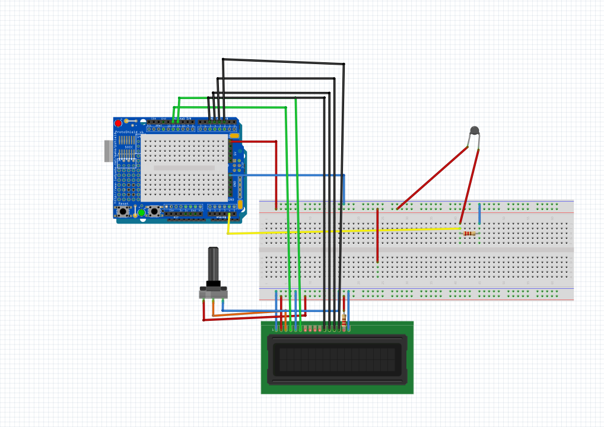

# Simple-Thermostat
This project involves using a thermistor to build a basic thermostat that displays the temperature on an LCD screen.

# Introduction
This project involved designing a circuit involving a thermistor to measure temperature. A thermistor is a variable resistor whose resistance greatly changes with temperature. Using the thermistor to measure the temperature involved constructing a voltage divider circuit by placing the thermistor in series with a resistor. The voltage output between the thermistor and the resistor then changes as the temperature changes. This voltage can then be converted to a resistance, which allows the use of the Steinhart–Hart equation. The thermistor used was what is known as an NTC thermistor, which entails that the resistance will decrease as the temperature increases. The visual output of the thermostat was displayed via an LCD screen. For simplicity, the temperature was strictly displayed in degrees Celsius.

# Components
1. An ELEGOO UNO Microcontroller board.
2. An NTC thermistor (1000 ohms at 25 degrees Celsius)
3. A 10,000 ohm resistor in series.
4. An LCD screen
5. A Potentiometer
6. C++ based Arduino IDE

# Wiring Diagram

